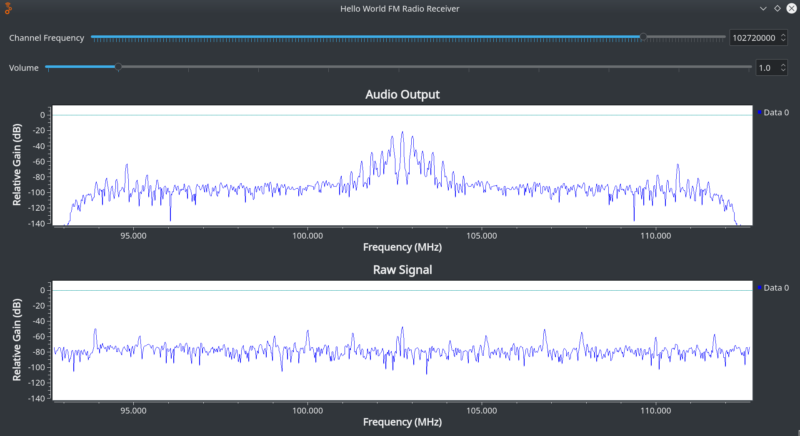

# Hello World FM Radio Receiver

This project is a very simple GNU Radio FM receiver. Unlike many examples online this uses the newer QT elements, so it's compatible with more recent versions of GNU Radio.

## Caveat

I am an absolute beginner with GNU Radio. While this project works well on GNU Radio `3.8.2.0`, I make no promise that this is the best way to handle broadcast FM nor that it'll work in all versions of GNU Radio.

My primary reason for publishing this is that all the previous GNU Radio examples I found were for older versions on the software before QT was introduced.
